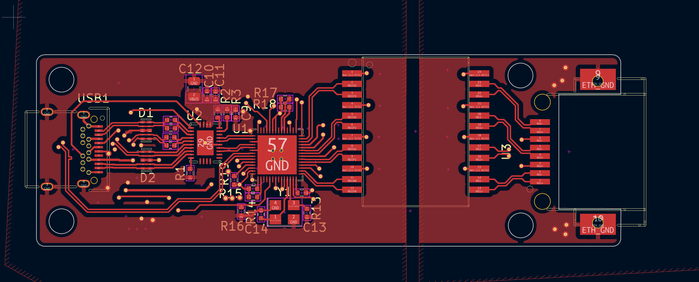
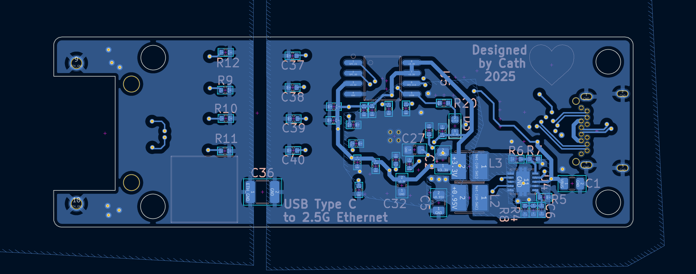
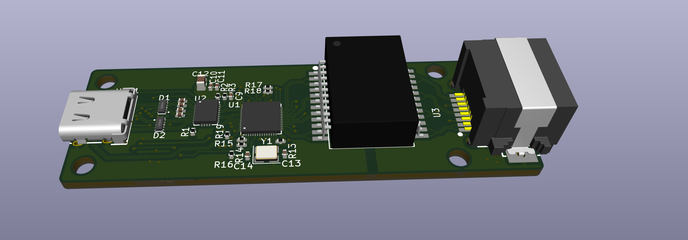
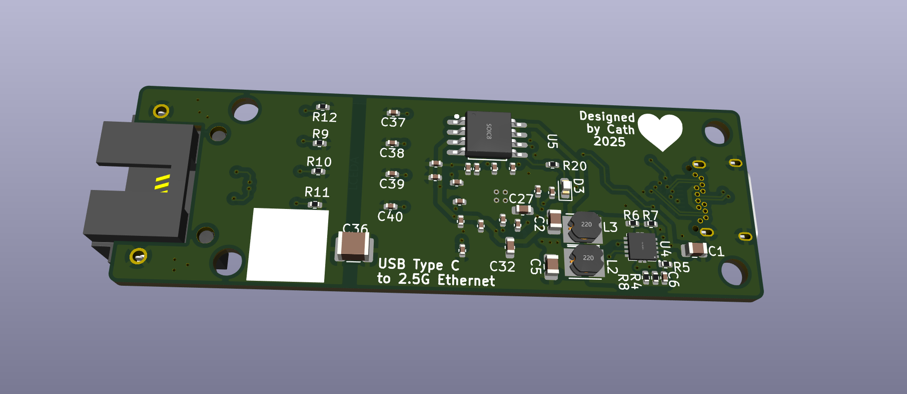

# USB 3.2 gen 1 to 2.5Gb Ethernet
 2.5GbE to USB C using VL162 and RTL8156

 ## VL162

  - 4:2 10Gbps USB Type-C Data Switch

  - Low power consumption with 6mW active at device mode

 ## RTL8156BG 

  - Integrated 10/100/1000M/2.5G transceiver

  - Supports USB 3.0, 2.0, and 1.1

 ## TPS62420

 - 5V to 3.3V DC-DC (600mA)
 - 5V to 0.95V DC-DC (1A)

 ## W25Q16BVSSIG

 - 16Mbit SPI Flash  

 ## LX82405SP
 -2.5GbE Magnetics 
## PCB 
This board uses a 4 layer stackup with a  1.6mm thickness:

- POWER/SIGNAL

- GND
  
- GND
  
- POWER/SIGNAL

High Speed diferential lines need a refrence ground plane so internal planes are ground referance planes for the High speed USB lines

### Schematic:

## PCB Screenshots

